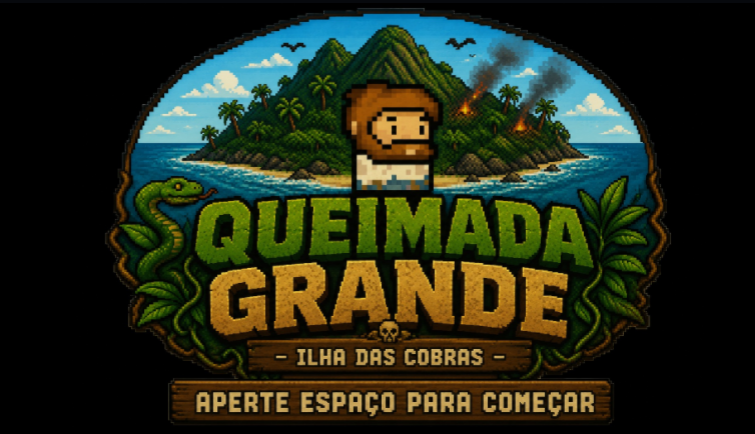
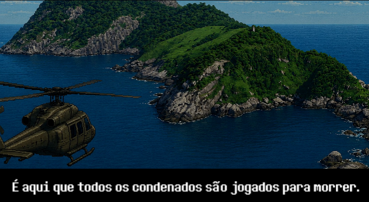
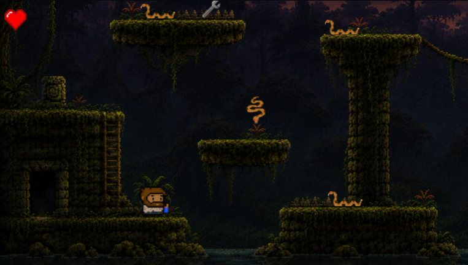
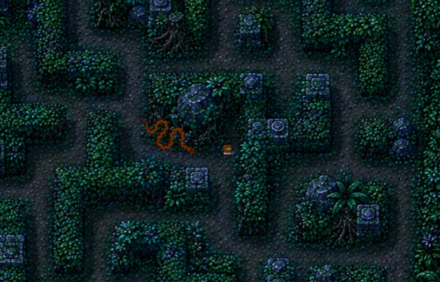

# Queimada-Grande-Construct3

Jogo desenvolvido para atividade da faculdade.

Tecnologias:
- Construct 3
- Eventos visuais

Objetivo:
Criar um jogo funcional utilizando o limite de 50 eventos da versão gratuita do Construct 3.

Autores:
Felipe Gomes, Davi Carbone, Laura Inácio.
## Imagens

### Menu

### Cutscene

### Gameplay

### Fase Final

